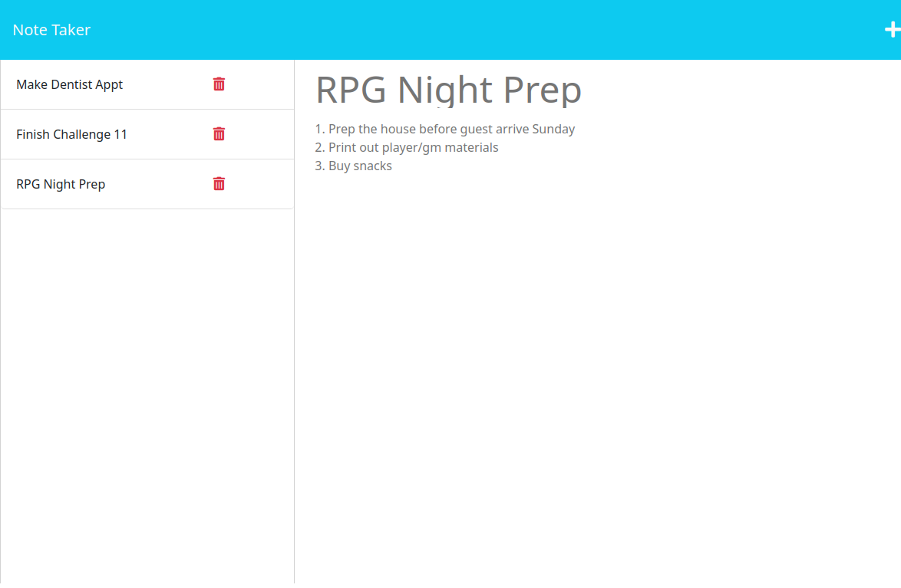

# wk11c-my-notes

## Description

This application allows the user to view, add, and remove notes to better keep track of tasks as well as organize their thoughts. It uses nodejs and express npm packages for the backend of the application to update the database file and process the server routes.

## Installation

- Clone the repo into your installation folder
- Open a terminal and navigate to your installation folder
- Run 'npm i' to install the required modules

## Usage

Open a terminal into the application directory and run "node server"to start the node backend. Then open a browser and enter "localhost:3001" into the address bar. Click the "Get Started" button to load any existing notes. Click on a note on the left to view it. The "+" button will allow the user to enter a new note. Clicking the save icon will save the note to the database file.

## Credits

Frontend starter code provided here: https://github.com/coding-boot-camp/miniature-eureka

## License

Refer to the LICENSE in the repo.
